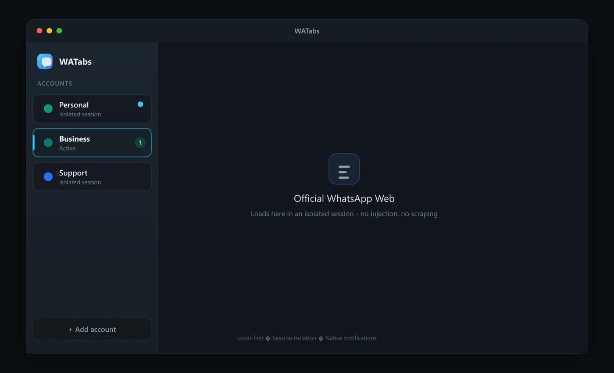

<div align="center">


# WATabs

### Multiple WhatsApp Web accounts. One secure desktop app.

Use Personal, Business, Support, and other WhatsApp Web accounts inside one clean desktop workspace, with every account running in its own individual session.

<br />



<br />

[](https://github.com/harshkolte01/WATabs/releases)
[](https://github.com/harshkolte01/WATabs/actions)
[](./LICENSE)
[](https://github.com/harshkolte01/WATabs/stargazers)
[](https://github.com/harshkolte01/WATabs/releases)

<br />

[Download](#download) · [Features](#features) · [How It Works](#how-it-works) · [Development](#development) · [Security](#security)

</div>

---

## Multiple accounts without multiple browsers

WATabs is an open-source multi-account WhatsApp desktop app for using multiple WhatsApp Web accounts from one place.

Each account runs inside a separate persistent browser session. Cookies, local storage, cache, service workers, login state, and permissions remain isolated between accounts.

```text
Personal ─────── Isolated Session A
Business ─────── Isolated Session B
Support ──────── Isolated Session C
```

WATabs does not build a separate WhatsApp client. It securely displays the official WhatsApp Web interface inside isolated desktop tabs powered by Electron `WebContentsView`.

---

## Preview

<div align="center">



</div>

> Shell preview of the WATabs workspace (safe for public docs — no chats, phone numbers, or QR codes). Replace with a capture from dedicated test accounts before marketing screenshots go live.

---

## Why WATabs?

Using multiple browsers, incognito windows, or browser profiles becomes difficult when you manage several WhatsApp accounts.

WATabs brings those accounts into one focused desktop workspace.

| Traditional setup                | WATabs                                  |
| -------------------------------- | --------------------------------------- |
| Multiple browser windows         | One organized desktop app               |
| Accounts mixed between profiles  | Isolated session for every account      |
| Difficult account switching      | Fast sidebar navigation                 |
| Inconsistent background behavior | Tray and notification support           |
| Browser clutter                  | Dedicated WhatsApp Web workspace        |
| Unclear session management       | Add, disable, clear, or remove accounts |

---

## Features

<table>
<tr>
<td width="50%" valign="top">

### Multiple isolated accounts

Add Personal, Business, Support, Store, or other WhatsApp Web accounts and switch between them instantly.

### Persistent sessions

Each account keeps its own authentication state, cookies, local storage, cache, IndexedDB, service workers, and permissions.

### Native notifications

Continue receiving supported WhatsApp Web notifications while WATabs is minimized or running in the system tray.

### Account controls

Rename, reorder, mute, disable, reload, clear, or remove accounts from one sidebar.

### File sharing

Use normal WhatsApp Web functionality to upload and download images, videos, PDFs, and documents.

</td>
<td width="50%" valign="top">

### Media permissions

Control microphone, camera, notification, and screen-sharing permissions separately for each account.

### Local-first privacy

Account sessions and application settings remain on your computer. WATabs does not provide a cloud service for storing your WhatsApp sessions.

### System tray

Keep accounts available in the background without keeping the main window open.

### App lock

Optionally protect the WATabs interface with a local PIN.

### Crash recovery

Recover individual account views without affecting other active accounts.

### Automatic updates

Receive application updates while preserving local account sessions.

</td>
</tr>
</table>

---

## How It Works

WATabs uses Electron `WebContentsView` with a separate persistent session partition for every account.

```text
WATabs Desktop
│
├── Application Shell
│   ├── Account Sidebar
│   ├── Settings
│   ├── Downloads
│   └── Permission Controls
│
├── Personal
│   └── persist:wa-account-a
│       └── Official WhatsApp Web
│
├── Business
│   └── persist:wa-account-b
│       └── Official WhatsApp Web
│
└── Support
    └── persist:wa-account-c
        └── Official WhatsApp Web
```

Every partition maintains separate:

- Cookies
- Login state
- Local storage
- IndexedDB
- Cache Storage
- Service workers
- Site permissions
- HTTP cache

One account cannot access the browser session belonging to another account.

---

## Privacy by design

WATabs is a browser container, not a messaging API or automation platform.

### WATabs does not

- Read or index your messages
- Read your contacts
- Extract conversation names
- Inject JavaScript into WhatsApp Web
- Modify the WhatsApp Web interface
- Automate messages or clicks
- Provide bulk messaging
- Export authenticated browser sessions
- Upload sessions to a WATabs server
- Store notification contents
- Create a unified inbox outside WhatsApp

### WATabs does

- Open the official WhatsApp Web interface
- Keep accounts in isolated local sessions
- Manage windows, tabs, permissions, and downloads
- Let users interact with WhatsApp Web manually
- Store application preferences locally

For stronger protection of local browser-session files, enable operating-system disk encryption such as BitLocker on Windows or FileVault on macOS.

---

## Security model

Remote WhatsApp Web content runs with:

```text
Node.js integration     Disabled
Context isolation       Enabled
Renderer sandbox        Enabled
Web security            Enabled
Preload access          None
Application IPC         None
Filesystem access       None
Script injection        None
```

The application also applies:

- Strict navigation controls
- External-link validation
- Origin-restricted permissions
- Isolated persistent partitions
- Signed production packages *(in progress)*
- Application updates via GitHub Releases
- Redacted local diagnostic logs

Verify locally with:

```bash
pnpm verify:no-injection
pnpm verify:fuses
```

Read the complete security policy in [`SECURITY.md`](./SECURITY.md).

---

## Download

> WATabs is under active development. Signed production installers will ship through [GitHub Releases](https://github.com/harshkolte01/WATabs/releases).

### Windows

```text
WATabs-Setup-x64.exe
```

### macOS Apple Silicon

```text
WATabs-arm64.dmg
```

### macOS Intel

```text
WATabs-x64.dmg
```

Linux support is planned after the Windows and macOS releases are stable.

[View all releases](https://github.com/harshkolte01/WATabs/releases)

---

## Development

### Requirements

- Node.js 20+ (LTS)
- pnpm 10+
- Windows or macOS
- Git

### Clone the repository

```bash
git clone https://github.com/harshkolte01/WATabs.git
cd WATabs
```

### Install dependencies

```bash
pnpm install
```

### Start development mode

```bash
pnpm start
```

`pnpm dev` is an alias for the same command.

### Type checking

```bash
pnpm typecheck
```

### Run unit tests

```bash
pnpm test:unit
```

### Security checks

```bash
pnpm verify:no-injection
pnpm package
pnpm verify:fuses
```

### Package the desktop application

```bash
pnpm package
pnpm make
```

---

## Project structure

```text
watabs/
├── apps/
│   └── desktop/              Electron app (main, preload, renderer)
├── packages/
│   ├── shared-types/
│   ├── validation/
│   ├── eslint-config/
│   └── testing/
├── assets/
│   ├── logo/
│   └── readme/
├── tests/
│   ├── unit/
│   ├── security/
│   ├── integration/
│   └── manual-whatsapp/
├── scripts/
├── site/                     Public landing site (Vercel)
├── docs/
├── README.md
└── package.json
```

---

## Roadmap

### Foundation

- [x] Secure Electron application shell
- [x] React and TypeScript interface
- [x] Persistent account partitions
- [x] Account sidebar
- [x] Account creation and removal
- [x] Session restoration

### Desktop experience

- [x] Native notifications
- [x] Per-account notification controls
- [x] System tray
- [x] Download manager
- [x] Camera and microphone permissions
- [x] App lock
- [ ] Start at login polish

### Production

- [x] Packaging pipeline (Electron Forge)
- [x] Updater wiring (GitHub Releases)
- [ ] Windows signed installer
- [ ] macOS signed application
- [ ] macOS notarization
- [ ] Live auto-update acceptance
- [ ] Accessibility review
- [ ] Security review
- [ ] First stable release

### Future

- [ ] Linux support
- [ ] Two-account split view
- [ ] Workspace groups
- [ ] Per-account download folders
- [ ] Additional themes
- [ ] Improved diagnostics

Follow development through [GitHub Issues](https://github.com/harshkolte01/WATabs/issues) and [GitHub Discussions](https://github.com/harshkolte01/WATabs/discussions).

---

## Contributing

Contributions are welcome.

Good first contributions include:

- Windows and macOS testing
- Electron security improvements
- Accessibility improvements
- UI refinements
- Download reliability
- Notification testing
- Documentation
- Localization
- Automated testing

Before opening a pull request:

1. Read [`CONTRIBUTING.md`](./CONTRIBUTING.md).
2. Check existing issues and pull requests.
3. Keep changes focused.
4. Add tests when applicable.
5. Never introduce message automation, scraping, DOM injection, or session export.

---

## Security

WATabs handles persistent authenticated browser sessions, so security reports should not be posted publicly before maintainers have had time to investigate.

Read [`SECURITY.md`](./SECURITY.md) for responsible disclosure instructions.

Never include the following in an issue:

- Cookies
- Authentication tokens
- QR codes
- Phone numbers
- Personal messages
- Session directories
- Private screenshots
- Diagnostic files containing sensitive information

---

## Support

Before opening an issue:

- Search existing issues
- Confirm you are using the latest release
- Remove private information from screenshots and logs

Use:

- [GitHub Issues](https://github.com/harshkolte01/WATabs/issues) for reproducible bugs
- [GitHub Discussions](https://github.com/harshkolte01/WATabs/discussions) for questions, feedback, and ideas
- [`SECURITY.md`](./SECURITY.md) for security reports

Public site: [`site/`](./site/) → [watabs.vercel.app](https://watabs.vercel.app)

---

## Frequently Asked Questions

### Does WATabs read my messages?

No. WATabs is designed to display the official WhatsApp Web interface without reading, indexing, or exporting your chats.

### Does WATabs support multiple accounts?

Yes. Every account is assigned an isolated persistent browser session.

### Does WATabs automate messages?

No. Message automation, scheduled messaging, bulk messaging, scraping, and auto-replies are intentionally outside the project scope.

### Where are sessions stored?

Sessions are stored locally in isolated Chromium profiles managed by the desktop application.

### Does removing an account delete my WhatsApp account?

No. It removes the local browser session from WATabs. It does not delete the WhatsApp account.

### Is WATabs an official WhatsApp application?

No. WATabs is an independent and unofficial browser container.

### Will every WhatsApp feature work?

Feature availability depends on what the official WhatsApp Web interface currently supports in the Electron environment.

---

## Disclaimer

WATabs is an independent, unofficial browser container.

It is not affiliated with, endorsed by, sponsored by, or officially connected with WhatsApp LLC or Meta Platforms, Inc.

WhatsApp and related names, logos, and trademarks belong to their respective owners.

WATabs loads the official WhatsApp Web interface. Availability and functionality depend on WhatsApp Web and may change without notice.

Users are responsible for complying with all applicable terms, policies, laws, and regulations.

---

## License

WATabs is licensed under the [MIT License](./LICENSE).

See also [`PRIVACY.md`](./PRIVACY.md) for local-first privacy details.

---

<div align="center">

### Multiple accounts. One focused workspace.

If WATabs is useful to you, consider starring the repository and sharing feedback.

[Star WATabs](https://github.com/harshkolte01/WATabs/stargazers) · [Report a bug](https://github.com/harshkolte01/WATabs/issues/new) · [Request a feature](https://github.com/harshkolte01/WATabs/issues/new)

</div>
